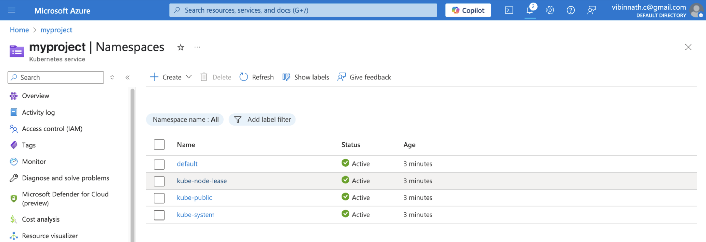
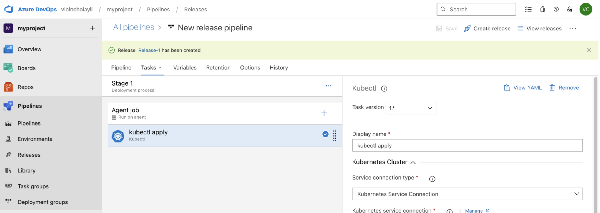
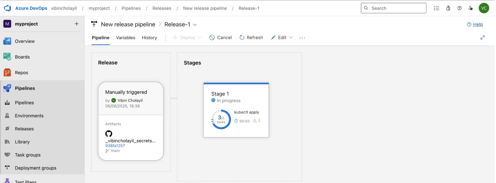
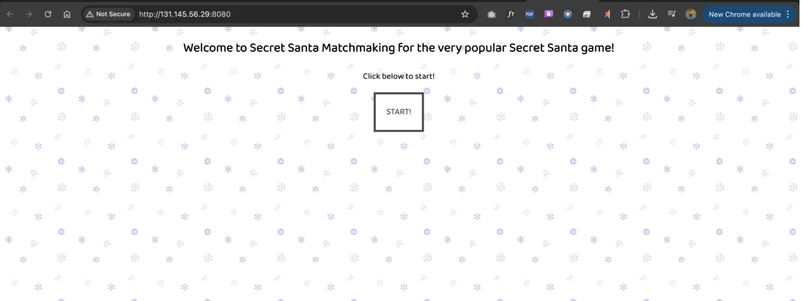

# Manual CI/CD Pipeline Implementation with Azure DevOps, Docker, and Kubernetes.

## Introduction  
It’s a hands-on documentation of step-by-step implementation of a full CI/CD pipeline using Azure DevOps, Docker, and Kubernetes. I have deployed a secret-santa project at the end.  

---

## DevOps technologies used

- **Azure DevOps**
- **Docker**
- **Kubernetes (AKS)**
- **Azure Ubuntu VM**
- **GitHub**
- **Docker Hub**

## My steps:
 - Project Setting.
 - Ubuntu VM in Azure
 - Set up Azure DevOps agent and install Docker 
 - Connect GitHub for code and pipeline trigger 
 - Build Docker image and pushing to Docker Hub 
 - Create Kubernetes cluster in Azure 
 - Created release pipeline for K8s
 - Managing the app with Kubernetes and pipelines

## Step 1 : Project Setting  
Resource name: **Azure DevOps**

I have created a project setting in “Azure Devops organization”.   
Organization Name: “Vibincholayil”  

Settings change 1:  
**Organization settings → Pipeline → Settings → [off] “Disable creation of classic build pipelines” and “Disable creation of classic release pipelines”** (Enable this two option will help me to create new pipeline with “use the classic editor”)  

Settings change 2:  
**Organization settings → Security → Policies → [on] “Allow public projects”**

I have created a project named “myproject”in my organisation  
Navigation Flow: **My Azure DevOps Organizations → Create Project → Done**  


## Step 2 :  Ubuntu VM in Azure 
Resource name: **Azure VM**
Minimum 2 CPU and 8GB Ram

 
Installed Prerequisites on the VM after login to VM through iterm.

```
sudo apt update
sudo apt install openjdk-17-jre -y
sudo apt install maven -y

sudo apt-get install apt-transport-https ca-certificates curl gnupg-agent software-properties-common
curl -fsSL https://download.docker.com/linux/ubuntu/gpg | sudo apt-key add -
sudo add-apt-repository "deb [arch=amd64] https://download.docker.com/linux/ubuntu $(lsb_release -cs) stable"
sudo apt-get update
sudo apt-get install docker-ce docker-ce-cli containerd.io

sudo usermod -aG docker $USER && newgrp docker

sudo usermod -aG docker learning
sudo usermod -aG root learning

sudo reboot

docker info

```
## Step 3: Setting up Azure DevOps agent and installing Docker 

Navigation flow: **Organisation → project settings → Pipelines → Agent pools → Create**  

 
Add pool inside Agent pools
As i am created the ubuntu VM i want to install Linux agent

Navigation flow: **Myprojectpool → Add pool → new agent**

 
I have entered my VM and create a directory  and copied suggested file and extracted and configure and run it 

 
 
Navigation flow for access token: **Azure Devops → Personal Access Tokens (right top corner) → copy & paste**  

“Myagent” is now visible inside my Agent pools “myprojectpool” but it is offline for making it online i have to run the configuration ./run.sh .

## Step 4: Connecting GitHub for code and pipeline trigger 
Create pipeline
Navigation flow: **“myproject” → Pipeline → Create Pipeline → Use the classic editor to create a pipeline without YAML. → GitHub → Authorize using OAuth → Select Repo → Select template → Maven → Apply → Agent pool “myprojectpool”**  

Create 3 files and confirm everything is perfect.

 

Run Pipeline
Navigation flow : **save and queue → comment (deploy) → Save and run.**  

 
After completing the initial test of the pipeline, I wanted to add Docker to the Agent job, so I clicked on the 'Edit' option.

## Step 5: Building Docker image and pushing to Docker Hub 

I installed both the 'Docker CLI Installer' and 'Docker'. Then, I added the Docker container registry in the 'Build and Push' task.

Create Container registry
Navigation flow: Container Resposity → Container registry → New → Registry type (Docker Hub) → provide Docker ID and Password → Service connection details (myprojectrepo) → Security → toggle (Grant access permission to all pipelines) → Verify and save

Remove : “Add Pipeline metadata to image(s)” and “Add base image metadata to image(s)”

 
**Save and queue → Run pipeline for docker build → Save and run** 

## Step 6: Creating Kubernetes cluster in Azure and deploying the app 
I created a Kubernetes cluster named “myproject” and updated the default node pool to use the Standard_A2_v2 VM size, which provides 2 vCPUs and 4 GiB of memory.

 
These are the namespace

## Step 7: Created release pipeline for K8s

For creating a release pipeline.
Navigation flow: **Pipeline → Release → New pipeline → Select a template → empty job → confirm (stage name and owner)**

Add Agent job → Kubectl (search) 
Add Artifact: **Add → Github → Select repo → branch → version → Add** 
Add Stage  (job)

Kubernetes service connection in Kubectl
**New → Azure subscription → Authrisation → cluster (vibin) → Namespace (default) → (toggle) Use cluster admin credentials → Service Connection Name (myprojectcontainer2) → Security (toggle) Grant access permission to all pipelines** 

**Add Commands → [apply] → (toggle) use configuration → File path → link git file → save → OK**

Create release

 
 
When i click on “Release-1” i can see the release pipeline and click on stage and trigger “deploy”. I can find success.

## Step 8: Managing the app with Kubernetes and pipelines 
 
Now i can find my load balancer ip provided by cluster.

 
Here is my Secret-santa webapp
 
Played!

ERROR:
ERROR commend: 
The pipeline is not valid. Job Job_1: Step  input containerRegistry references service connection undefined which could not be found. The service connection does not exist, has been disabled or has not been authorized for use. For authorization details, refer to https://aka.ms/yamlauthz.


The error occurred because I forgot to specify the Docker Hub container registry name while setting up the image build and push task.
 I later change the container registry to “vibincholayil” and repository name to “myprojectcontainer”
After updating the pipeline to point to this correct registry & repository, the error was resolved and my image is visible in docker hub. 

